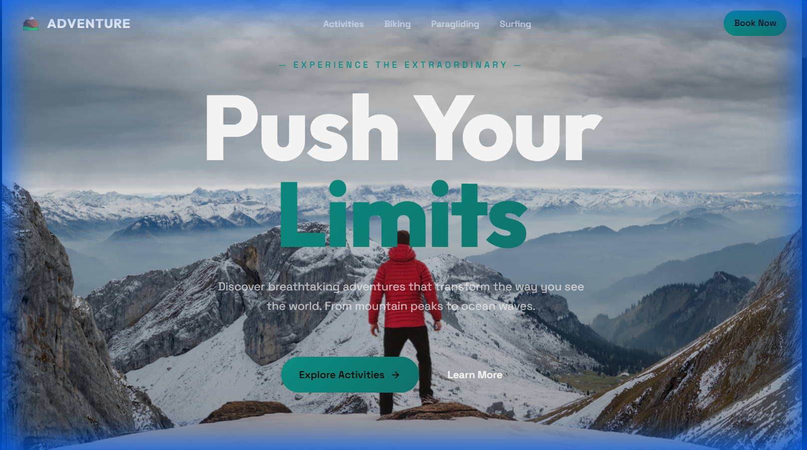
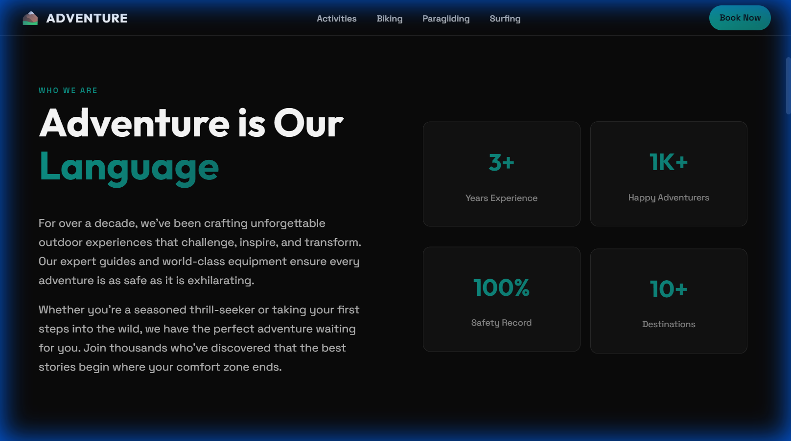
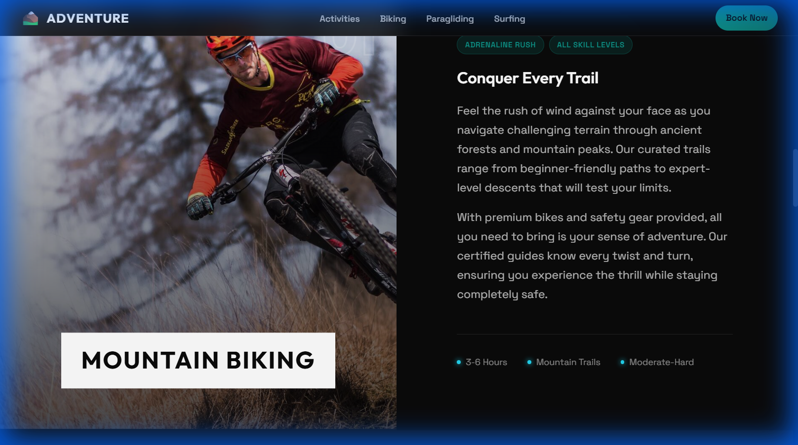
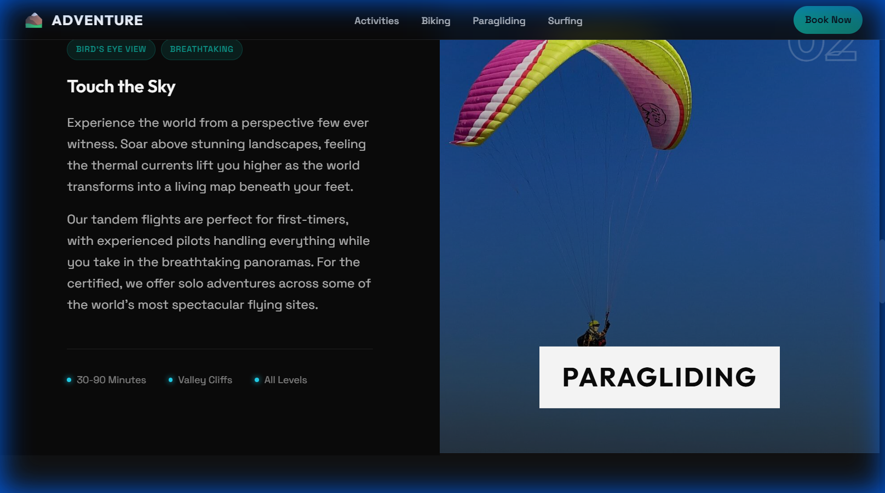
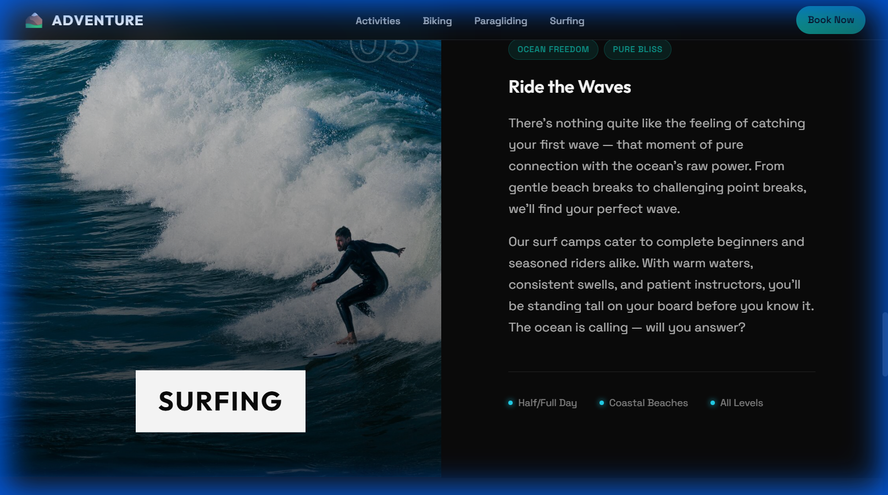
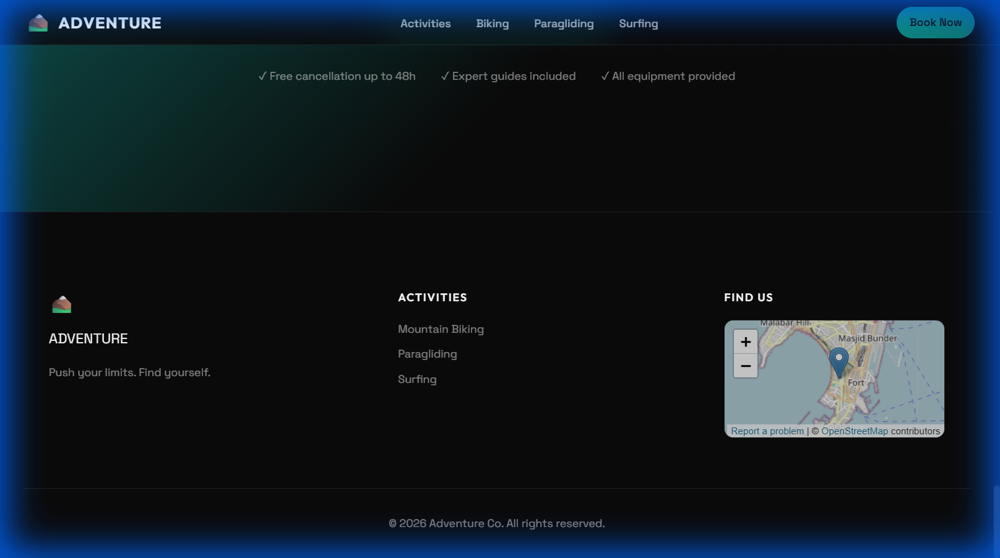

# 🏔️ Adventure Parallax

> *Push your limits. Experience the extraordinary.*

A stunning, immersive parallax landing page for adventure travel and outdoor activities — built with pure HTML, CSS & JavaScript. No frameworks, no dependencies, just buttery-smooth performance.


---

## Preview

### Hero Section
<p align="center">
  
</p>
<p align="center"><em>🏔️ Immersive parallax hero with stunning mountain visuals</em></p>

### About Section
<p align="center">
  
</p>
<p align="center"><em>Company intro with animated statistics cards</em></p>

### Activities

<table>
  <tr>
    <td width="33%">
      
      <p align="center"><strong>Mountain Biking</strong></p>
    </td>
    <td width="33%">
      
      <p align="center"><strong>Paragliding</strong></p>
    </td>
    <td width="33%">
      
      <p align="center"><strong>Surfing</strong></p>
    </td>
  </tr>
</table>

### Footer & CTA
<p align="center">
  
</p>
<p align="center"><em>Call-to-action with trust badges and embedded map</em></p>

---

## Features

- **Multi-layer Parallax Effect** — Immersive depth with background and foreground layers that respond to scroll
- **Smooth Scroll Animations** — Elements gracefully fade and slide into view using Intersection Observer
- **Responsive Design** — Looks stunning on desktop, tablet, and mobile devices
- **Performance Optimized** — Uses `requestAnimationFrame`, passive event listeners, and CSS `will-change` for 60fps scrolling
- **Accessibility Aware** — Respects `prefers-reduced-motion` for users who prefer minimal animations
- **Touch Device Support** — Gracefully adapts parallax behavior for touch screens
- **Modern Typography** — Google Fonts (Outfit & Space Grotesk) for a premium feel
- **Zero Dependencies** — Pure vanilla HTML, CSS, and JavaScript

---

## Sections

| Section | Description |
|---------|-------------|
| **Hero** | Full-screen parallax with mountain imagery and bold CTA |
| **About** | Company intro with animated statistics cards |
| **Activities** | Showcases Mountain Biking, Paragliding & Surfing |
| **CTA** | Final call-to-action with trust badges |
| **Footer** | Navigation links with embedded OpenStreetMap |

---

## 🚀 Quick Start

1. **Clone the repository**
   ```bash
   git clone https://github.com/RishiBuilds/adventure-parallax.git
   ```

2. **Open in browser**
   ```bash
   cd adventure-parallax
   # Simply open index.html in your browser
   start index.html   # Windows
   open index.html    # macOS
   ```

3. **Or use a local server** (recommended for best performance)
   ```bash
   npx serve .
   ```

---

## Project Structure

```
adventure-parallax/
├── index.html              # Main HTML file with inline JS
├── styles.css              # All styling and animations
├── README.md               # You're here!
│
├── background.png          # Parallax background layer (mountains)
├── foreground.png          # Parallax foreground layer (silhouette)
├── biking.jpg              # Mountain biking activity image
├── para gliding.jpg        # Paragliding activity image
├── surfing.jpg             # Surfing activity image
├── License
├── screenshot.png          # Hero section preview
├── screenshot-about.png    # About section preview
├── screenshot-biking.png   # Mountain biking preview
├── screenshot-paragliding.png  # Paragliding preview
├── screenshot-surfing.png  # Surfing preview
└── screenshot-footer.png   # Footer & CTA preview
```

---

## Customization

### Colors
Edit the CSS custom properties in `styles.css` to match your brand:
```css
:root {
  --color-primary: #your-color;
  --color-accent: #your-accent;
}
```

### Images
Replace the image files with your own:
- `background.png` — Main parallax background
- `foreground.png` — Foreground silhouette layer
- Activity images in the respective sections

### Content
All text content is in `index.html` — simply edit the HTML to update copy.

---

## Performance

This site is built with performance in mind:

- **Preloaded critical images** for faster LCP
- **Passive scroll listeners** to prevent jank
- **GPU-accelerated transforms** via `translate3d`
- **Lazy-loaded map iframe** to reduce initial payload
- **Optimized font loading** with `font-display: swap`

---

## Browser Support

| Browser | Support |
|---------|---------|
| Chrome | Full |
| Firefox | Full |
| Safari | Full |
| Edge | Full |
| Mobile Browsers | Optimized |

---

## License

This project is open source and available under the [MIT License](LICENSE).

---

## Acknowledgments

- Mountain imagery inspired by the great outdoors
- Typography by [Google Fonts](https://fonts.google.com/)
- Map powered by [OpenStreetMap](https://www.openstreetmap.org/)

---

<p align="center">
  Made with ❤️ and a love for adventure
</p>
